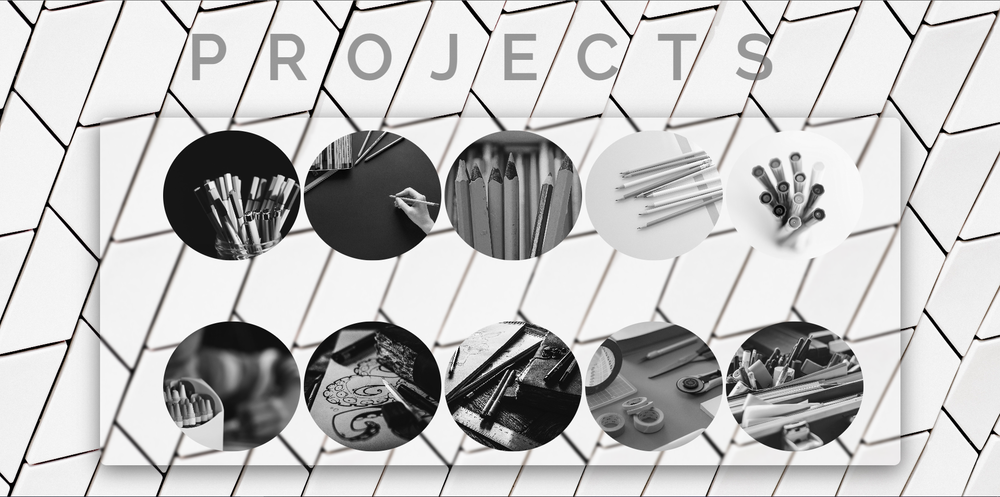
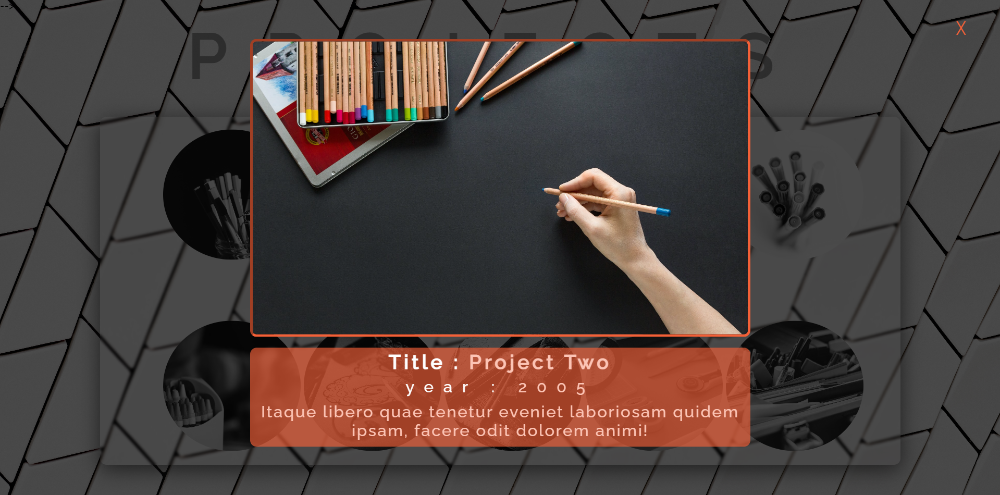

# WebApp-By-JS

<h1>Moda Box App </h1>

Modal box is a simple app I developed it with html , css and pure JavaScript 
in addition responsive  feature by using media query css

These are screenshots for this app

 
 

